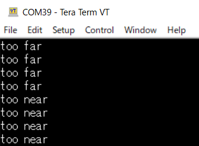

# CH101/201 Mof-Mof (softness) sensor information and sample program for Raspberry Pi Pico

This is the Raspberry Pi Pico library for the TDK/Invensense/Chirp CH101/201.  

Mof-Mof means __soft object__. This information is to make the Mof-Mof sensor with CH101/201 and Raspberry Pi Pico.  

The CH101/201 is a miniature, ultra-low-power ultrasonic Time-of-Flight (ToF) range sensor.  
Based on Chirp’s patented MEMS technology, the CH101/201 is a system-in-package that integrates a PMUT (Piezoelectric Micromachined Ultrasonic Transducer) together with an ultra-low-power SoC (system on chip) in a miniature, reflowable package. The SoC runs Chirp’s advanced ultrasonic DSP algorithms and includes an integrated microcontroller that provides digital range readings via I2C.  
The CH101/201 provides accurate range measurements to targets at distances up to 1.2m/5m.  
Using ultrasonic measurements, the sensor works in any lighting condition, including full sunlight to complete darkness, and provides millimeter-accurate range measurements independent of the target’s color and optical transparency.  

The CH101-00ABR/CH201-00ABR is a Pulse-Echo product intended for range finding and presence applications using a single sensor for transmit and receive of ultrasonic pulses.  
CH101/201 is sold by Digi-key in two types.  
MOD_CH101-03-01 is mounted on the small pwb with a FFC connector, and wearing a horn.  
CH101-00ABR is only IC chip. Operating range from 4 cm to 1.2m. you have to mount on PWB and put with horn.  
CH201-00ABR is only IC chip. Operating range from 20 cm to 5m. you have to mount on PWB.  

- [1 Directory](#1-directory)
- [2 How to run Mof-Mof program (Basic)](#2-how-to-run-mof-mof-program-basic)
  - [2.1 Hardware Connection](#21--hardware-connection)
  - [2.2 Prepare a Horn](#22-prepare-a-horn)
  - [2.3 Setup Raspberry Pi Pico](#23-setup-raspberry-pi-pico)
  - [2.4 Measure softness](#24-measure-softness)


# 1 Directory

* `exec/` contains executable file for Raspberry Pi Pico.
* `hardware/` contains Schematics, BOM, sample horn .stl file.
* `pic/` contains pictures for .md doc files.
* `source/` contains project source files.  

# 2 How to run Mof-Mof program (Basic)

## 2.1  Hardware Connection

PCB Schematic


Wiring to Raspberry Pi Pico.
PCB(J1,J2) | Raspberry Pi Pico
:---: | :---:
VDD | 3V3
INT | GP2
SCL | GP7
SDA | GP6
PROG | GP1
nRESET | GP0
DIR | GP3
GND | GND

## 2.2 Prepare a Horn (only needed CH101-00ABR for Mof-Mof)

A horn can be made by a 3D printer using the following .STEP file:  
[hardware/AH-12026-045045-A1_931_v1.0.STEP](hardware/AH-12026-045045-A1_931_v1.0.STEP)  
Please convert to .stl from .STEP by using any 3d-CAD.

Attach the horn to CH101-00ABR perfectly after reflow.  
It is better to harden with a small amount of epoxy resin.  

## 2.3 Setup Raspberry Pi Pico

1. Connect the micro USB cable to your host computer.
1. Connect the other end of the micro USB cable to the Pico while pressing BOOTSEL button on the Pico.
1. Release the button once the cable is connected.  
   A disk volume "RPI-RP2" will appear on your computer.
1. Drag and drop the `exec/MofMof_CH201.uf2` file to RPI-RP2.

## 2.4 Measure softness

After Raspberry Pi Pico setup, reconnect Raspberry Pi Pico to your host computer.  
Open TeraTerm or any other terminal emulator.

### Recommended sequence of command execution


### Command "set"

Initialize sensor and config measurement setting
```
set
```
sample log for CH101  


sample log for CH201  


### Command "mof"

Start measuring the softness of the object.  
Keep anything out of the 90deg angle range from the sensor and confirm there is nothing detected by sensor.  
Place the object exactly at a distance of 200mm(CH101) or 300mm(CH201) from the sensor, otherwise the sensor will give feed back either "To far" or "To near".  
Softness will appear after a while in %. 0% means hardness like metal plate, 100% means softness like cushion.  
The object must be flat, vertically to the sensor.  

```
mof
```

 




### Command "clear"

Clear the internal buffer used by the "mof" process.  

```
clear
```

### Command "dist"

Start measurement of distance. Distance will appear in millimeters.  

```
dist
```


### Command "enter key"

Stop measurement.

```
press enter key
```
