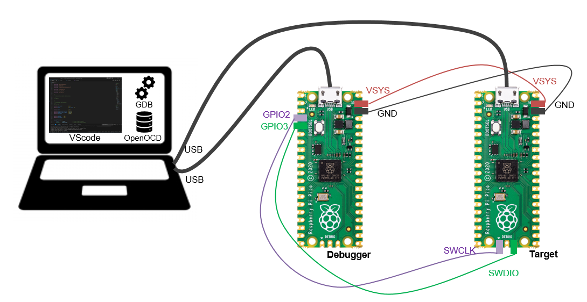
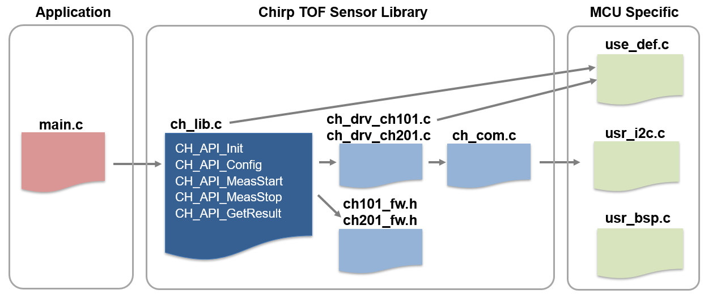
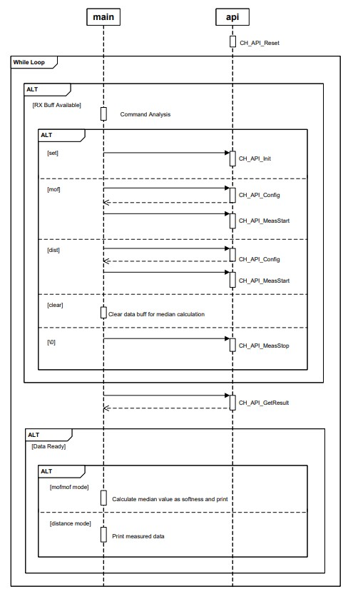
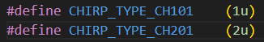
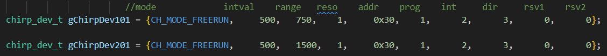
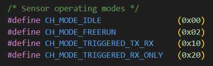
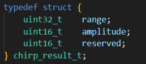

 # CH101/CH201 Mof-Mof (softness) sensor module application note

This guide explains the program structure and APIs, which supports you to have a general understanding of how the measurement works.  

- [CH101/CH201 Mof-Mof (softness) sensor module application note](#ch101ch201-mof-mof-softness-sensor-module-application-note)
- [1 Directory](#1-directory)
- [2 How to run Mof-Mof program (Advanced)](#2-how-to-run-mof-mof-program-advanced)
  - [2.1 Write a new main.c file with APIs](#21-write-a-new-mainc-file-with-apis)
    - [2.1.1 Register Map](#211-register-map)
    - [2.1.2 Program Structure](#212-program-structure)
    - [2.1.3 Sequence of main.c](#213-sequence-of-mainc)
    - [2.1.4 Introduction of APIs](#214-introduction-of-apis)
  - [2.2 Use a micro-controller other than Raspberry Pi Pico](#22-use-a-micro-controller-other-than-raspberry-pi-pico)
    - [2.2.1 Functions need redefinition in usr\_bsp.c](#221-functions-need-redefinition-in-usr_bspc)
    - [2.2.2 Functions need redefinition in usr\_i2c.c](#222-functions-need-redefinition-in-usr_i2cc)
    - [2.2.3 Required modification in usr\_def.c](#223-required-modification-in-usr_defc)


# 1 Directory

* `exec/` contains executable file for Raspberry Pi Pico.
* `hardware/` contains Schematics, BOM, sample horn .stl file.
* `pic/` contains pictures for .md doc files.
* `source/` contains project source files.  


# 2 How to run Mof-Mof program (Advanced)

## 2.1 Write a new main.c file with APIs

5 APIs are pre-defined, you can use them to build a unique sequence based on your use case. please take the sequence of main.c as reference. As debugging environment, it is recommended to use a second Raspberry Pi Pico as debugger to access the SWD port on the target Raspberry Pi Pico. For details, please check out the following documentation.  
https://datasheets.raspberrypi.com/pico/getting-started-with-pico.pdf
https://datasheets.raspberrypi.com/pico/raspberry-pi-pico-c-sdk.pdf



Debugger | Target
:---: | :---:
VSYS | VSYS
GND | GND
GPIO2 | SWCLK
GPIO3 | SWDIO

### 2.1.1 Register Map

Link: Not available.

### 2.1.2 Program Structure



### 2.1.3 Sequence of main.c


### 2.1.4 Introduction of APIs

* ### CH_API_Init

Initialize chirp sensor.

```
1. Specify sensor type.
2. Initialize variables and I/O pins.
3. Setup I2C communication. 
4. Confirm sensor connection.
5. Write firm wire to sensor.
6. Wait until sensor is ready for measurement.
7. RTC calibration.
```

parameter | uint16_t type <br> <br>
:---: | :---:
return | 0 if successful, otherwise -1      

* ### CH_API_Config
Setup measurement configuration.
```
1. Set sensor mode.
2. Set measurement range.
3. Set interval
3. set static range for ch101 and threshold for ch201.
```

\* Note: If the arguments specified in this API are not valid, the values defined in the usr_def.h file will be used. 



parameter | <ul><li> uint8_t mode   </li><li> uint16_t range_mm (up to 750mm)</li><li>uint16_t interval_ms (>50ms) <br> <br>
:---:  | :---
return | 0 if successful, otherwise -1  
    
Note:   
* Free-Running vs. Hardware-Triggered mode   
In Free-Running (Self-Timed) mode, the CH101/CH201 uses an internal clock (RTC) to autonomously establish the sampling period. The wake  
interval is set by writing to a specific register in the sensor. The sensor will then periodically wake up, perform a measurement, notify  
the host, and go back to a low-power sleep mode. No interaction with the remote host is required.  
In the Hardware-Triggered modes (either Tx/Rx or Rx-only), the sensor is awakened (triggered) by the INT line being asserted by the 
remote host system, performs its measurement, notifies the host system, and then goes back to low-power sleep. The remote host 
system is responsible for setting up a periodic timer to initiate the sensor measurements on the desired schedule

* ### CH_API_MeasStart

start measurement.

```
start measurement.
```

parameter | none
:---: | :---:
return | none

* ### CH_API_MeasStop

Stop measurement.

```
stop measurement.
```

parameter | none
:---: | :---:
return | none

* ### CH_API_GetResult

get measurement result from sensor.

```
get measurement result form sensor periodically.
```

parameter | chirp_result_t *p_result <br> <br> 
:---:  | :------------------------------
return | 0 if successful, otherwise -1  

## 2.2 Use a micro-controller other than Raspberry Pi Pico

By redefining functions in usr_bsp.c, usr_def.c and usr_i2c.c, Mof-Mof can be run on any other micro-controller.

### 2.2.1 Functions need redefinition in usr_bsp.c

- #### void USR_TimerEnable(uint16_t interval)

 description| enable timer interrupt
:---------: | :------------------------------
parameter   | interval (measurement interval in msec)
return      | 0 if successful, otherwise -1  

- #### void USR_TimerDisable(void)

 description| disable timer interrupt
:---------: | :------------------------------
parameter   | none
return      | none 

- #### void USR_IntrEnable(uint8_t pin)

 description| enable IO interrupt
:---------: | :------------------------------
parameter   | pin (GPIO pin)
return      | none

- #### void USR_IntrDisable(uint8_t pin)

 description| disable IO interrupt
:---------: | :------------------------------
parameter   | pin (GPIO pin)
return      | none

- #### void USR_GPIO_Init(void)

 description| initialize IO pins
:---------: | :------------------------------
parameter   | none
return      | none 

- #### void USR_GPIO_Set(uint8_t pin, uint8_t level)

 description| Set GPIO pin to High or Low
:---------: | :------------------------------
parameter   | pin (GPIO pin) <br> level (high/low)
return      | none 

- #### uint8_t USR_GPIO_Get(uint8_t pin)

 description| Get the level of the GPIO pin
:---------: | :------------------------------
parameter   | pin (GPIO pin)
return      | level of the GPIO pin

- #### void USR_GPIO_SetDir(uint8_t pin, uint8_t dir)

 description| Set the direction of GPIO pin
:---------: | :------------------------------
parameter   | pin (GPIO pin) <br> dir (IN/OUT)
return      | none

- #### void USR_GPIO_SetPullUp(uint8_t pin)

 description| Set pull up of GPIO pin
:---------: | :------------------------------
parameter   | pin (GPIO pin)
return      | none

- #### void USR_GPIO_SetPullDown(uint8_t pin)

 description| Set pull down of GPIO pin
:---------: | :------------------------------
parameter   | pin (GPIO pin)
return      | none

- #### void USR_WaitMS(uint16_t time)

 description| Wait time in msec
:---------: | :------------------------------
parameter   | time (msec)
return      | none

- #### void USR_WaiTUS(uint16_t time)

 description| Wait time in usec
:---------: | :------------------------------
parameter   | time (usec)
return      | none

### 2.2.2 Functions need redefinition in usr_i2c.c

- #### int8_t USR_I2C_Config(uint64_t speed)

 description| Config I2C communication
:---------: | :------------------------------
parameter   | speed (I2C speed in Hz)
return      | 0 if successful, otherwise -1  

- #### int8_t USR_I2C_Write(uint8_t i2c_addr, uint8_t *buffer, uint16_t len)

 description| Writing process of I2C communication
:---------: | :------------------------------
parameter   | i2c_addr	(i2c address) <br> buffer (pointer to data to write) <br> len (data length to write)
return      | 0 if successful, otherwise -1  

- #### int8_t USR_I2C_Read(uint8_t i2c_addr, uint8_t *wr_buffer, uint16_t wr_len, uint8_t *rd_buffer, uint16_t rd_len)

 description| Reading process of I2C communication
:---------: | :------------------------------
parameter   | i2c_addr	(i2c address) <br> wr_buffer (pointer to data to write) <br> wr_len (data length to write) <br> rd_buffer (pointer to data to read) <br> rd_len	(data length to read)
return      | 0 if successful, otherwise -1  


### 2.2.3 Required modification in usr_def.c

Assign GPIO pins  

